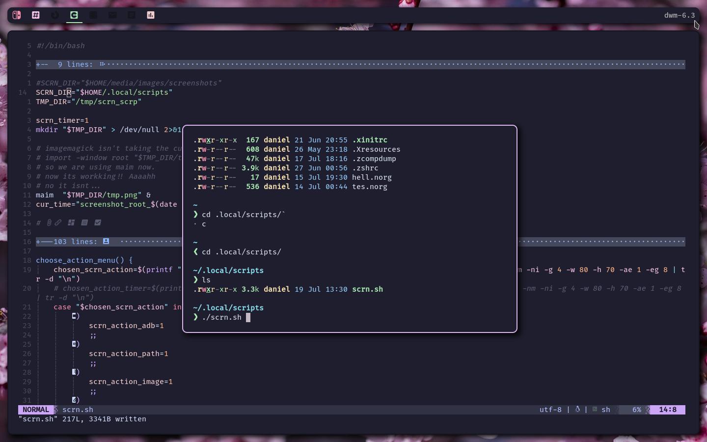
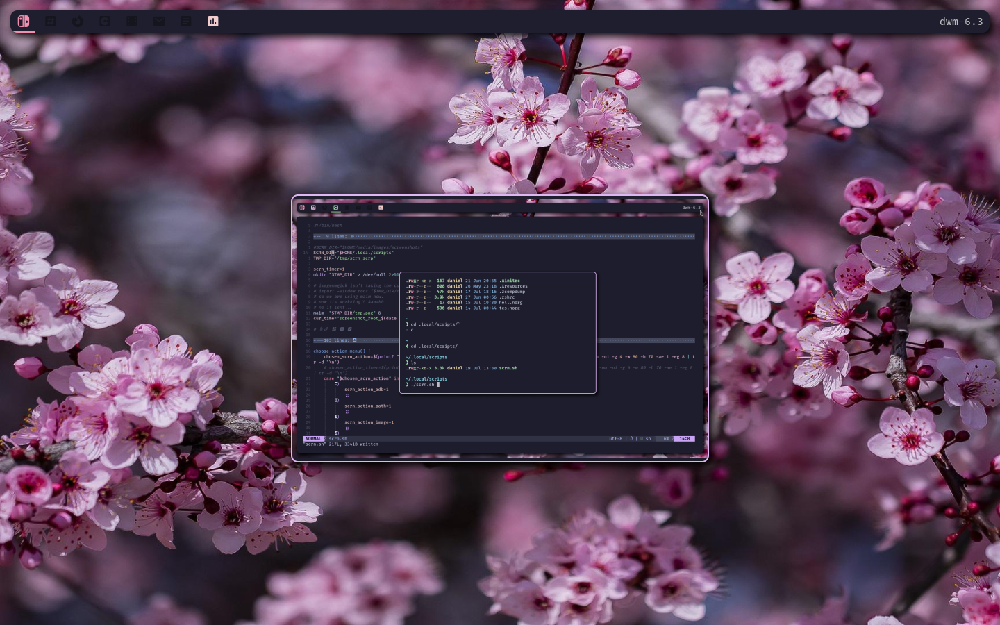
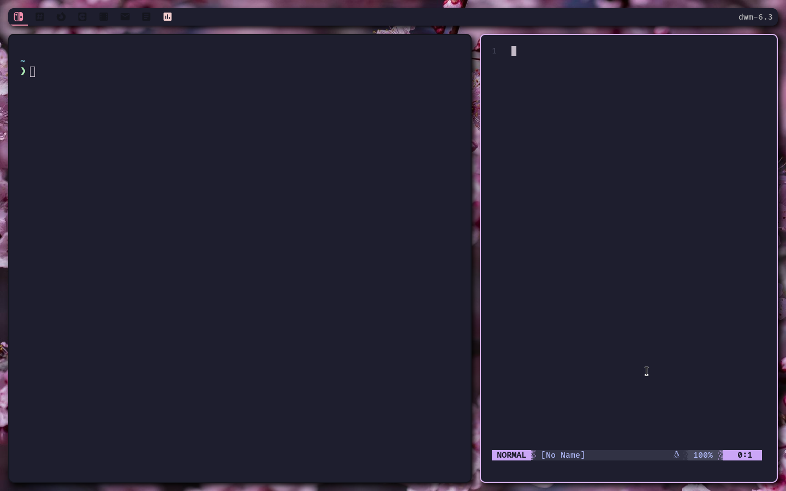

# My build of suckless's dwm

This is my build of [suckless's](https://suckless.org) [dwm](https://dwm.suckless.org).
For more information on building and configuring dwm, vist dwm's home
[page](https://dwm.suckless.org).

# Screenshots

# Colorscheme

Ofcourse, the colorscheme is [Catppuccin](https://github.com/catppuccin).

# Patches

`./patches` directory contains all the patches applied to this build. Other than
that there are some of my own modifications to the source code. To know more
about the changes, view git logs. To be honest that git log is a mess, my
modifications and the modifications done by the patches are all together in
single big commit. Because I didn't even know how to use git back then, when I
was playing with dwm.

## List of patches

Btw, these are the patches applied from suckless's website

- activetagindicatorbar
- actualfullscreen
- alwayscenter
- bar-height
- barpadding
- notitle
- pertag
- rainbowtags
- scratchpads
- status2d
- swallow
- underlinetags
- uselessgap
